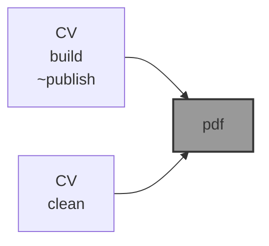

# 📜 CV

📜 `CV` is an 🪄 [`awesome-bash-cli`](https://github.com/kamangir/awesome-bash-cli) (`abcli`) plugin for [my](https://abadpour.com/) CV, in two versions: [compact](https://abadpour-com.s3.ca-central-1.amazonaws.com/cv/arash-abadpour-resume.pdf) and [full](https://abadpour-com.s3.ca-central-1.amazonaws.com/cv/arash-abadpour-resume-full.pdf).

```bash
pip install abadpour
```



---

[](https://pypi.org/project/abadpour/)
