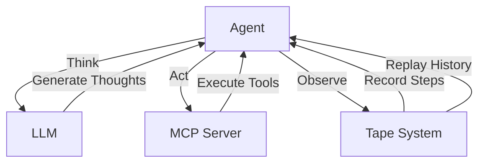

# Lightweight Agent Framework

<p align="center">
  
</p>

A minimalist, extensible framework for building autonomous agents with a focus on transparency and composability.

## Overview

Lightweight Agent Framework (LAF) provides a simple yet powerful foundation for building autonomous agents that can think, act, and observe within a structured environment. With LAF, you can:

- Create agents that follow a clear think-act-observe cycle
- Record and replay agent interactions using the tape system
- Build complex workflows by composing multiple agents
- Persist and analyze agent execution history
- Extend functionality through a modular tool system
- Integrate with external tools and services using the **Model Control Protocol (MCP)**

---

## System Architecture

The following diagram illustrates how the components of the Lightweight Agent Framework fit together:



### Key Components:
- **Agent**: The core entity that performs the think-act-observe cycle.
- **LLM**: Large Language Model used by the agent to generate thoughts and reasoning.
- **MCP Server**: External server that provides tools and services for the agent to execute actions.
- **Tape System**: Records the agent's execution history for analysis, debugging, and replay.

---

## Key Features

- 🎯 **Simple Core Concepts**: Based on three fundamental operations - think, act, and observe
- 📼 **Tape-Based History**: Record every step of your agent's execution for analysis and debugging
- 🛠 **Modular Tools**: Easily extend agent capabilities through a flexible tool system
- 💾 **Built-in Storage**: Persist agent history with built-in SQLite support (expandable to other backends)
- 🔄 **Async Support**: Built with asyncio for efficient concurrent operations
- 🧪 **Testing Ready**: Comprehensive testing utilities and fixtures included
- 🤖 **MCP Integration**: Seamlessly integrate with external tools and services using the Model Control Protocol

---

## Quick Installation

```bash
pip install robotape
```

For development installation:

```bash
pip install robotape[dev]
```

---

## Basic Usage

Here's a simple example of creating and running an agent:

```python
from robotape.agents import SimpleAgent
from robotape.tape import Tape, StepType

# Create an agent and a tape
agent = SimpleAgent("my_agent")
tape = Tape()

# Add an initial thought
tape.append(Step(
    type=StepType.THOUGHT,
    content="I should search for information",
    metadata=StepMetadata(agent="my_agent", node="planning")
))

# Execute the agent
await agent.execute_step(tape.get_last_step())
```

---

## Using MCPLLMAgent

The `MCPLLMAgent` is a specialized agent that combines the capabilities of LLMs with the **Model Control Protocol (MCP)**. It allows agents to interact with external tools and services through an MCP server, enabling more complex workflows and integrations.

### Example: Using MCPLLMAgent

```python
from robotape.agents.mcpllm import MCPLLMAgent
from robotape.llm import LLMConfig

# Configure the LLM
llm_config = LLMConfig(
    model="gpt-4",
    api_key="your-api-key",
    provider_name="openai"
)

# Configure the MCP server
mcp_config = {
    "command": "python",
    "args": ["path/to/mcp_server.py"],
    "env": {"ENV_VAR": "value"}
}

# Create an MCPLLMAgent
agent = MCPLLMAgent("mcp_agent", llm_config, mcp_config)

# Connect to the MCP server
await agent.connect()

# Execute a full think-act-observe cycle
context = {"task": "Analyze test data"}
thought_result = await agent.think(context)
action_result = await agent.act(thought_result)
observe_result = await agent.observe(action_result)
```

---

## Advanced Features

- **Custom Agents**: Extend `BaseAgent` to create specialized agents
- **Tool Integration**: Add new capabilities through the tool system
- **Storage Backends**: Built-in SQLite support, extensible to other databases
- **Tape Management**: Clone, branch, and analyze execution history
- **Validation**: Built-in parameter validation and error handling
- **MCP Integration**: Connect to external tools and services using the Model Control Protocol

---

## Documentation

For detailed information, check out:

- [Getting Started Guide](docs/getting_started.md)
- [Tape System Documentation](docs/tape_system.md)
- [Agent System Guide](docs/agents.md)

---

## Development

Clone and set up the development environment:

```bash
git clone https://github.com/andrewlwn77/robotape.git
cd robotape
pip install -e ".[dev]"
```

Run tests:

```bash
pytest tests/ --cov=robotape
```

---

## Contributing

1. Fork the repository
2. Create a feature branch (`git checkout -b feature/amazing-feature`)
3. Commit your changes (`git commit -m 'Add amazing feature'`)
4. Push to the branch (`git push origin feature/amazing-feature`)
5. Open a Pull Request

---

## License

This project is licensed under the MIT License - see the [LICENSE](LICENSE) file for details.
