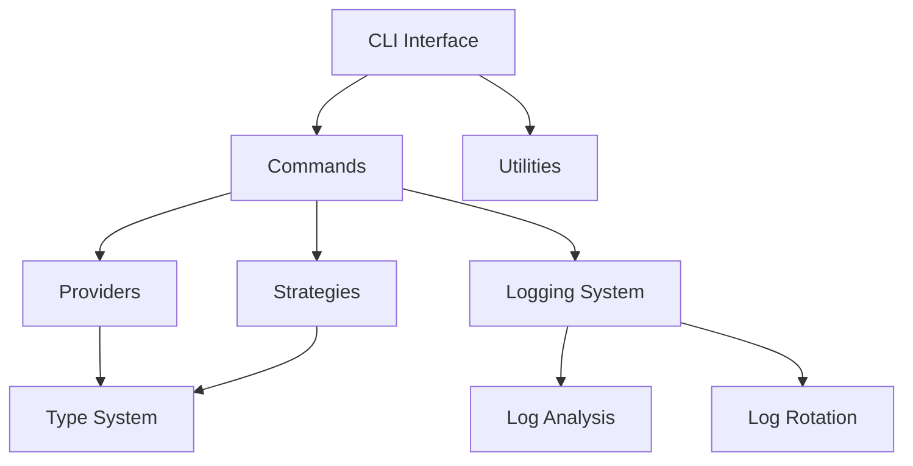

# Архитектура Send2LLM

## Основные компоненты

### CLI Система
- **Команды**
  * `single_shot`: Одиночные запросы к LLM
  * `interactive`: Интерактивный режим работы
  * `config`: Управление конфигурацией
  * `logs`: Управление логами
- **Утилиты**
  * `validation`: Валидация входных данных
  * `formatting`: Форматирование вывода
  * `config`: Работа с конфигурацией
  * `logging`: Система логирования
  * `log_rotation`: Ротация логов
  * `log_analysis`: Анализ логов

### Система типов
- **Common**
  * Базовые перечисления
  * Общие модели данных
  * Утилитарные типы
- **Base**
  * Основные типы запросов
  * Базовые интерфейсы
- **Errors**
  * Типы ошибок
  * Обработка исключений
- **Providers**
  * Специфичные для провайдеров типы

### Провайдеры
- **OpenAI**
  * GPT-3.5/4 модели
  * Streaming поддержка
  * Function calling
- **Perplexity**
  * Sonar модели
  * Web search
  * Цитирование
- **Anthropic**
  * Claude модели
  * Контекстное окно 100K+

### Стратегии
- **Basic**
  * Прямая отправка запросов
  * Базовая валидация
- **Retry**
  * Повторные попытки
  * Экспоненциальная задержка
- **Fallback**
  * Переключение провайдеров
  * Обработка ошибок
- **Chain**
  * Цепочки запросов
  * Агрегация результатов

### Система логирования
- **Логи**
  * CLI команды
  * LLM запросы
  * Ошибки и исключения
- **Ротация**
  * По размеру
  * По времени
  * Сжатие
- **Анализ**
  * Статистика использования
  * Распределение ошибок
  * Активность пользователей

## Взаимодействие компонентов

## Принципы проектирования

1. **SOLID**
   - Single Responsibility
   - Open/Closed
   - Liskov Substitution
   - Interface Segregation
   - Dependency Inversion

2. **Clean Architecture**
   - Независимость от фреймворков
   - Тестируемость
   - Независимость от UI
   - Независимость от базы данных
   - Независимость от внешних сервисов

3. **DRY (Don't Repeat Yourself)**
   - Переиспользование кода
   - Абстракции
   - Утилиты

4. **KISS (Keep It Simple, Stupid)**
   - Простые решения
   - Понятный код
   - Минимум зависимостей

## Безопасность

1. **API ключи**
   - Хранение в .env
   - Защита от утечек
   - Ротация ключей

2. **Валидация**
   - Проверка входных данных
   - Санитизация
   - Ограничения доступа

3. **Логирование**
   - Аудит действий
   - Мониторинг ошибок
   - Защита чувствительных данных 