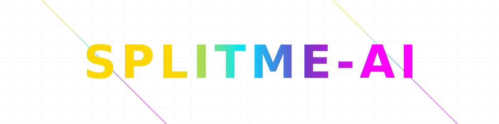

# <!-- -->

  

    

      
    

    <h2 class="tagline">
      Markdown Splitter: Modular Docs, Maximum Flexibility
    </h2>
  

  <h2>Quick Start</h2>
  

    

      
1. In the terminal, install package from PyPI:
      <pre><code>pip install -U splitme-ai</code></pre>
    

    

      
2. Once installed, try it out:

      <pre><code>splitme-ai --help</code></pre>
    

    

      
3. Generate a README file for your project:

      <pre><code>splitme-ai </code></pre>
    

  

---
